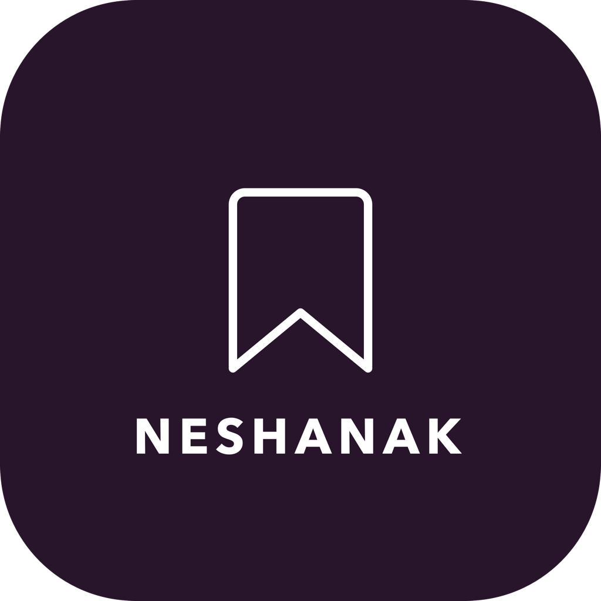
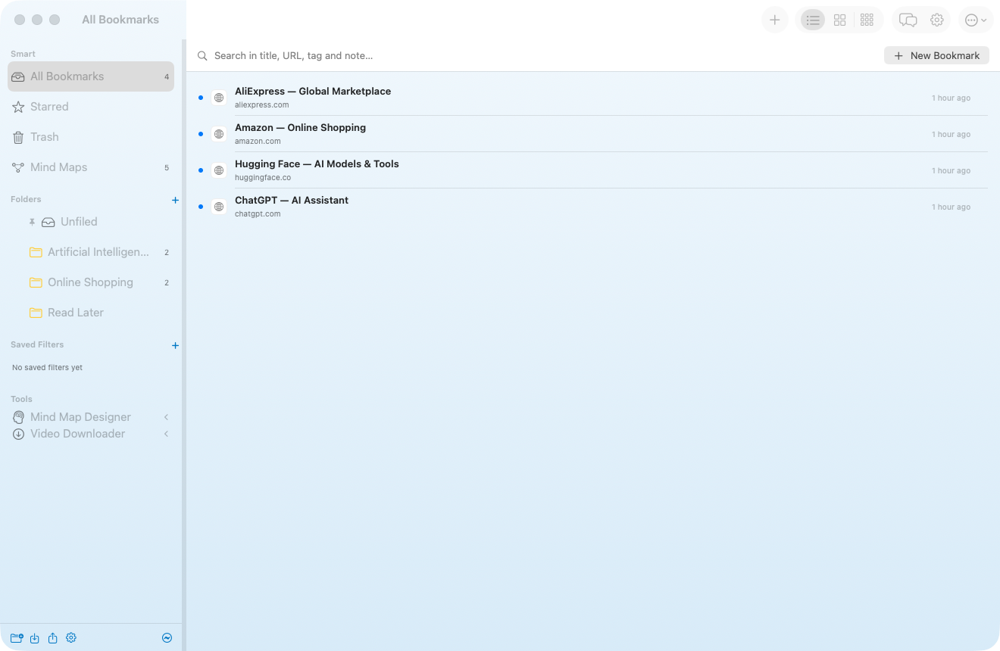
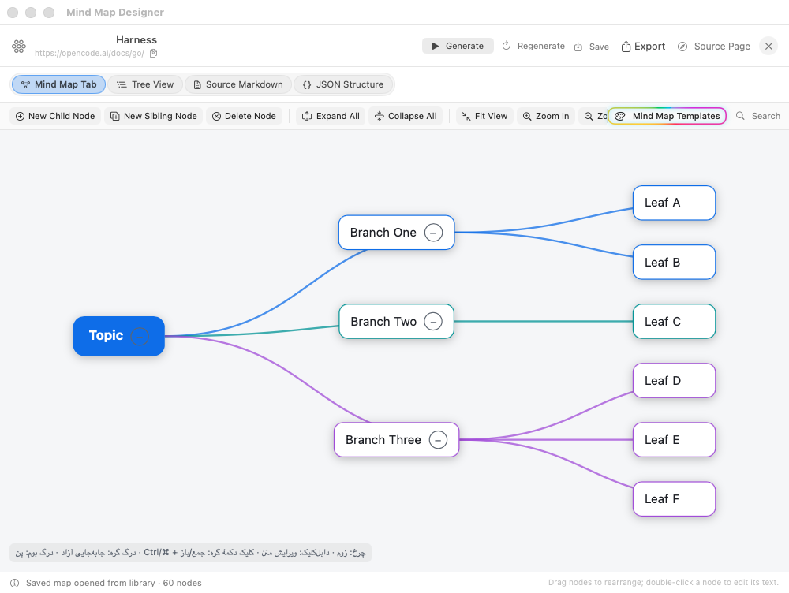
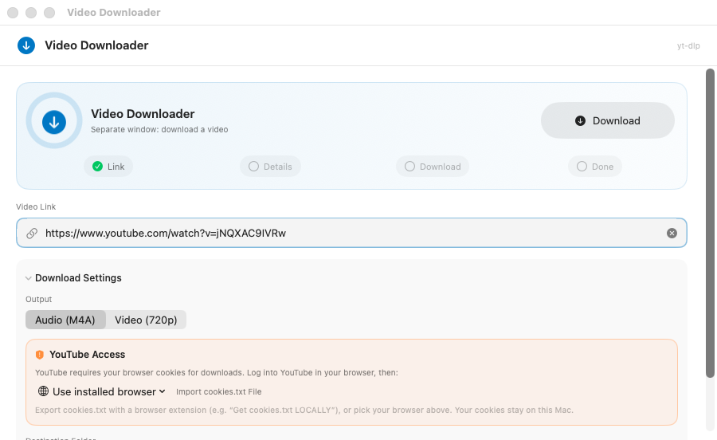
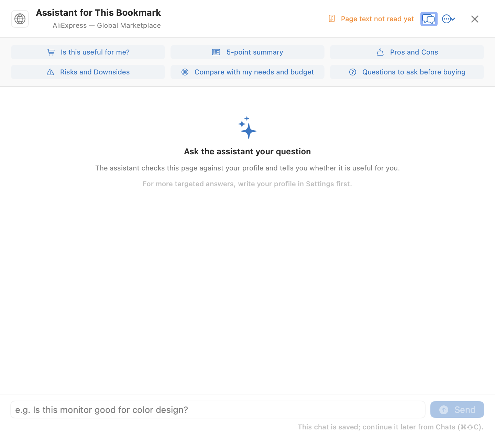

<a id="english"></a>
<div align="center">
  
  <h1>📌 Neshank · نشانک</h1>
  <p>
    <b>Native, offline-first bookmark manager for macOS</b> — folders &amp; full-text search,
    AI chat about your saved links, link&nbsp;→&nbsp;visual&nbsp;mind&nbsp;map,
    a built-in free video downloader, and a menu-bar quick box.<br>
    <b>مدیر نشانک بومی مک با رابط فارسی راست‌به‌چپ</b> — همه‌چیز محلی، بدون حساب، بدون ابر.
  </p>
  <p>
    
    
    
    
    <a href="https://github.com/hbk2636/neshank/actions/workflows/ci.yml"></a>
    
  </p>
  <p>English · <a href="#persian">فارسی</a> · <a href="../../releases/latest">⬇️ Download v1</a></p>
</div>

Neshank (**نشانک**, "bookmark") is an open-source **bookmark manager for macOS** built with **SwiftUI + SQLite** — no Electron, no cloud, no account, no Xcode required to build. It replaces a folder of scattered links with a fast, offline-first library where every saved page is **archived, searchable and ready to talk to**.

<table>
  <tr>
    <td></td>
    <td></td>
  </tr>
  <tr>
    <td></td>
    <td></td>
  </tr>
</table>

### ✨ Highlights

|  | Feature | What you get |
|---|---------|--------------|
| 🗂️ | **Bookmark manager** | Hierarchical folders, multi-tags, instant search over title / URL / notes / tags **and full page text** (SQLite FTS5), full-page screenshots, link health checker, trash with ⌘Z, Safari / Chrome / Firefox import-export |
| 📦 | **Menu-bar quick box** | A tiny box in the macOS menu bar — right next to battery & input indicator — paste a link and save it without opening the app window |
| ⌨️ | **Global hotkey** | One shortcut (default **⌘⇧Space**, remappable to ⌘⇧A / ⌘⇧H or off) opens the floating quick-add panel **from any app**, with no Accessibility permission needed (Carbon HotKey) |
| 🤖 | **AI chat about your links** | Connect any **OpenAI-compatible `/v1` provider** and pick the model in Settings. Ask *“does this fit my budget?”, pros/cons, 5-point summaries* — per bookmark, or across the whole library with numbered citations `[1] [2]` |
| 🧠 | **Link → visual mind map** | Turn a link (or a selection of bookmarks) into a visual mind map — **6 layouts/templates** in multiple color themes, engineered to stay useful even with **small / free models**. Live views: map · tree · markdown · JSON |
| ⬇️ | **Free video downloader** | Built-in downloader for **YouTube, Aparat and 1,700+ sites** (bundled `yt-dlp` — zero setup, no account, no server). Up to **720p in v1**, better quality coming |

### 🧰 Everything else

6 complete UI layouts (Classic, Aurora, Focus, Dashboard, Atlas, Orbit) · 10 accent colors + 6 themes · light/dark · full-page article archive with deep search · **Today** page (⌘⇧T) · command palette (**⌘K**) · decision log (“bought / skipped / maybe”) · saved filters · duplicate finder · folder colors & icons · multi-select bulk actions · daily automatic backups · Persian (RTL), English, Russian, Chinese localization · works fully offline.

## ⬇️ Quick start

**Download** the latest DMG from the **[Releases page](../../releases/latest)** → open → drag *نشانک* into Applications.

> Gatekeeper note: the app is ad-hoc signed — **right-click → Open** on first launch (or `xattr -cr /Applications/نشانک.app`).

**Build from source** (no Xcode needed, only Command Line Tools):

```bash
git clone https://github.com/hbk2636/neshank.git
cd neshank
./Scripts/build_app.sh        # → build/نشانک.app + نشانک-$VERSION.dmg
open "build/نشانک.app"        # run locally
zsh Scripts/run_tests.sh      # test suite (exit code 1 = failure, CI-friendly)
```

Requirements: **macOS 13+ (Ventura), Apple Silicon**. A full release build downloads the bundled tools once (pinned `yt-dlp`, arm64 `ffmpeg-static`, `deno` + PO-token provider) — end users need nothing.

## 🤖 AI setup (2 minutes)

Settings → **Assistant** → enter any OpenAI-compatible endpoint (OpenAI, OpenRouter, local **Ollama**, …): base URL (…`/v1`), API key, model name → **Test Connection**. Your key never leaves your Mac; only the bookmark you ask about (or cited excerpts for library chats) is sent to *your* provider. Works with free / small models — the mind-map and chat prompts are tuned for them.

## ⌨️ Shortcuts

| Key | Action |
|-----|--------|
| ⌘N | New bookmark |
| ⌘⇧Space | Global quick-add (any app) |
| ⌘K | Command palette (jump, search, ask) |
| ⌘⇧D | AI assistant for the selected bookmark |
| ⌘⇧C / ⌘⇧T | Chats / Today page |
| ⌘V | Paste URL + quick add (when no text field is focused) |
| ⌘Z / ⌘⌫ | Undo delete / move to trash |

Full list in the [Persian section](#persian) · README.

## 🏗 Architecture

```
Sources/NeshankYar/
  App/            entry point, window, menu bar, global key monitor, quick box
  Store/          thin SQLite layer (WAL, prepared statements) + main library logic
  Models/         bookmarks/folders/tags, settings, localization (fa/en/ru/zh), AI chat models
  Services/       PageMeta, HTMLText, Screenshotter, HotKey, LinkChecker,
                  ImportExport, AIClient (/v1), YtDlp, VideoBackends, MindMap export
  Views/          root, sidebar, list, details, editor, settings, quick-add panel,
                  mind-map tool, video tool, chats, command palette,
                  Designs/ — Aurora · Focus · Dashboard · Atlas · Orbit shells
  Resources/      MindMap/canvas.html (offline, self-contained), Extractor/ (Readability, Turndown)
Scripts/          build_app.sh (app + ICNS + DMG), run_tests.sh
docs/             design specs & phase reports (mind-map, downloader)
```

## 🧪 Tests

```bash
zsh Scripts/run_tests.sh
```

**57 checks, 0 failures** — URL normalization, localization dictionary health, schema migration, backups (snapshot / failure paths / daily pruning), mind-map layout invariants (balanced map, outline alignment, wire counts) and UI-design integrity. Exit code 1 = failure, so it slots straight into CI.

## 🙏 Credits

Neshank stands on the shoulders of these open-source projects — thank you:

- [**mind-elixir**](https://github.com/SSShooter/mind-elixir-core) (MIT) — early RTL-capable mind-map foundation the map tool grew from
- [**Mozilla Readability**](https://github.com/mozilla/readability) (Apache-2.0) — article extraction for the full-page archive (bundled with its license)
- [**Turndown**](https://github.com/mixmark-io/turndown) (MIT) — HTML → Markdown conversion (bundled)
- [**yt-dlp**](https://github.com/yt-dlp/yt-dlp) — the download engine bundled inside the app
- [**ffmpeg-static**](https://github.com/eugeneware/ffmpeg-static) · [**deno**](https://github.com/denoland/deno) · [**bgutil-ytdlp-pot-provider**](https://github.com/Brainicism/bgutil-ytdlp-pot-provider) — bundled media & PO-token tooling

## 🔒 Privacy

Local **SQLite** library; archived page text, screenshots and favicon caches stay in `~/Library/Application Support/NeshankYar/`. No telemetry, no account, no sync. Your AI key is stored only in this Mac's preferences — the app works completely offline except fetching page metadata, screenshots, link checks and downloads.

## 📄 License

[MIT](./LICENSE) © hosein shahraki. Bundled third-party tools and libraries keep their own licenses (see Credits).

<br>

## #️⃣ Tags

`#macos` `#bookmarks` `#bookmark-manager` `#productivity` `#mind-map` `#video-downloader` `#yt-dlp` `#ai-assistant` `#openai` `#swiftui` `#swift` `#sqlite` `#local-first` `#offline-first` `#privacy` `#rtl` `#persian` `#farsi` `#open-source` `#knowledge-management`

---

<a id="persian"></a>
## نشانک (NeshankYar) 📌 — نسخهٔ فارسی

<div dir="rtl">

مدیر نشانک **بومی مک** با رابط فارسی راست‌به‌چپ — ساخته‌شده با **SwiftUI + SQLite**، بدون هیچ وابستگی خارجی و بدون نیاز به Xcode (فقط Command Line Tools).

- **نام برنامه:** نشانک
- **نسخه:** ۱ (1.0) — نخستین انتشار عمومی
- **سازنده:** hosein shahraki
- **شناسه:** `com.gozaresh.neshankyar`


**دریافت:** [آخرین نسخه از صفحهٔ Releases](../../releases/latest) — بعد از نصب، برای دور زدن Gatekeeper روی برنامه **راست‌کلیک → باز کن (Open)**.

</div>

### ساخت و نصب

```bash
# ساخت کامل: .app + آیکون + امضا + DMG
./Scripts/build_app.sh

# خروجی‌ها
#   build/نشانک.app          برنامه
#   ./نشانک-$VERSION.dmg     بستهٔ نصب (در پوشهٔ پروژه + دسکتاپ)

open "build/نشانک.app"       # اجرای محلی
./Scripts/build_app.sh debug # نسخهٔ debug (سریع‌تر)
zsh Scripts/run_tests.sh     # مجموعهٔ تست (۵۷ موفق)
```

### امکانات

<div dir="rtl">

#### هسته

| بخش | جزئیات |
|---|---|
| افزودن نشانک | ⌘N — دکمهٔ «نشانک جدید» **همیشه در نوار بالای فهرست** دیده می‌شود؛ آدرس را بچسبان، عنوان/توضیح/تصویر/فاوآیکون خودکار از صفحه خوانده می‌شود |
| سازمان‌دهی | پوشهٔ سلسله‌مراتبی (زیرپوشه با کلیک‌راست، باز/بسته‌شدن درون‌خطی با شورون، حذف امن بدون از دست رفتن زیرپوشه‌ها) + برچسب‌های چندتایی |
| جستجو | فوری و debounceشده روی عنوان، آدرس، دامنه، یادداشت، برچسب **و متن کامل صفحات** (FTS5 با fallback به LIKE) |
| فیلترها | همه، ستاره‌دارها، نخوانده‌ها، لینک‌های مرده، بایگانی، زباله‌دان، هر پوشه، هر برچسب |
| نما | سه حالت به انتخاب کاربر (بین اجراها حفظ می‌شود): **فهرست**، **کارت‌های ریسپانسیو**، **سه‌ستونی/باکس** |
| چیدمان | سه ستون ریسپانسیو با جداکنندهٔ قابل کشیدن (عرض ستون‌ها حفظ می‌شود) |
| سلامت لینک | بررسی دسته‌ای (HEAD با fallback به GET)، تمایز «مرده» از «نامشخص» |
| ورودی/خروجی | فرمت Netscape مرورگرها (سافاری/کروم/فایرفاکس) |
| داده | SQLite محلی (WAL) + کش فاوآیکون/تصاویر/عکس‌ها در `~/Library/Application Support/NeshankYar/` |

#### بستهٔ بهره‌وری

| بخش | جزئیات |
|---|---|
| باکس منوی سیستم | **مینی‌باکس افزودن سریع در نوار منوی مک** (کنار باتری و زبان ورودی) — لینک را بچسبان و ذخیره کن، بدون باز کردن پنجرهٔ اصلی |
| افزودن سریعٔ سراسری | **⌘⇧Space** (قابل تغییر: ⌘⇧A / ⌘⇧H / غیرفعال) در هر برنامه‌ای — پنل شناور باز می‌شود، **بدون نیاز به مجوز سیستم** (Carbon HotKey) |
| چسباندن سریع | **⌘V** وقتی فیلد متنی فوکوس نیست → اگر کلیپ‌بورد آدرس باشد، پنل افزودن با آدرس پر می‌شود |
| رهاکردن لینک | لینک را از مرورگر روی پنجرهٔ برنامه **Drag & Drop** کنید → پنل افزودن باز می‌شود |
| حذف امن | حذف = رفتن به **زباله‌دان** (۳۰ روز نگه داشته می‌شود)؛ **⌘Z** آخرین حذف را برمی‌گرداند؛ «خالی کردن زباله‌دان» و «حذف قطعی» هم هست |
| انتخاب چندتایی | **⌘/⇧ کلیک** در هر سه نما + **نوار اقدامات گروهی**: انتقال به پوشه، افزودن برچسب، خوانده، بایگانی، حذف |

#### بستهٔ نقشهٔ ذهنی

| بخش | جزئیات |
|---|---|
| تبدیل لینک به نقشه | لینک (یا چند نشانک انتخاب‌شده) را بده → **نقشهٔ ذهنی بصری** بساز؛ متن صفحه از همان نشانک/آرشیو خوانده می‌شود |
| چیدمان و تمپلیت | **۶ چیدمان/تمپلیت** با چندین رنگ‌بندی — از جمله چیدمان متوازن دوطرفه (ریشه وسط، شاخه‌ها چپ/راست) |
| بهینه برای مدل‌های ضعیف | پرامپت و خروجی طوری تنظیم شده که حتی با **مدل‌های رایگان و کوچک** نتیجهٔ معقول بگیری |
| چهار نمای زنده | نقشه / درخت / مارک‌داون / JSON — همه در یک پنجره، بدون ریلود و بدون از دست رفتن رندر |
| کاملاً آفلاین | بوم رندر یک فایل خودکفا (`canvas.html`) داخل برنامه است — هیچ منبع ریموت لود نمی‌شود |

#### بستهٔ دانلودر ویدیو

| بخش | جزئیات |
|---|---|
| دانلودر داخلی | **YouTube، Aparat و ۱۷۰۰+ سایت** با `yt-dlp` باندل‌شده — بدون نصب ابزار، بدون حساب، بدون سرور |
| کیفیت | در نسخهٔ ۱ تا **۷۲۰p**؛ کیفیت‌های بیشتر در آینده |
| بدون تنظیم | همه‌چیز داخل `.app` است؛ کاربر DMG را نصب می‌کند و **همه‌چیز بدون هیچ تنظیمی** کار می‌کند |
| اطلاعات ویدیو | عنوان، کانال، مدت و بندانگشتی خودکار در نشانک پر می‌شود؛ پیشرفت دانلود زنده نمایش داده می‌شود |
| تشخیص خودکار | نشانک‌های یوتیوب/آپارات به‌عنوان «ویدیوی آمادهٔ دانلود» شناخته می‌شوند |

#### بستهٔ خواندن و بایگانی

| بخش | جزئیات |
|---|---|
| نسخهٔ کامل صفحه | متن کامل صفحه هنگام افزودن آرشیو می‌شود (قابل خاموش کردن) — حتی اگر سایت رفت، متن می‌ماند |
| جستجوی عمیق | متن آرشیو‌شده داخل ایندکس FTS5 است؛ جستجو به **محتوای صفحات** هم می‌رسد |
| عکس واقعی صفحه | با WKWebView از بالای صفحه عکس گرفته می‌شود و در کارت‌ها/باکس‌ها جای فاوآیکون را می‌گیرد (تشخیص خودکار عکس خالی/صفحهٔ خطا) |

#### بستهٔ دستیار هوشمند

| بخش | جزئیات |
|---|---|
| اتصال پروایدر | **پروتکل سازگار با OpenAI (`/v1`)** — آدرس سرویس، کلید و مدل را هر کاربر خودش در «تنظیمات ← دستیار هوشمند» انتخاب می‌کند (با دکمهٔ «تست اتصال») |
| گفتگو دربارهٔ لینک | با **یک یا چند لینک** دربارهٔ محتوایشان صحبت کن و مشاوره بگیر؛ دکمهٔ ✦ در سربرگ هر نشانک (یا **⌘⇧D**) → پنل گفتگو |
| پرسش‌های سریع | «به درد من می‌خورد؟»، «خلاصهٔ ۵ نکته‌ای»، «مزایا و معایب»، «ریسک‌ها و نکات منفی»، «مقایسه با نیاز و بودجهٔ من»، «سؤال‌های قبل از خرید» + گفتگوی آزاد |
| پرسش از کل کتابخانه | چت نوع «کتابخانه»: پرسش آزاد از میان همهٔ نشانک‌ها با **ارجاع شماره‌دار** ([۱]، [۲]…) و تراشه‌های قابل‌کلیک |
| زمینهٔ پاسخ | متن ذخیره‌شدهٔ صفحه + عنوان/آدرس/یادداشت/برچسب‌ها + پروفایل شما؛ اگر متن از قبل ذخیره نشده باشد، دستیار **هنگام نخستین پرسش خودش صفحه را می‌خواند** |
| صداقت پاسخ | قیمت/موجودی فقط اگر در صفحه آمده گفته می‌شود («طبق همین صفحه»)؛ اطلاعات ناقص حدس زده نمی‌شود |
| حریم خصوصی | فقط متن همان نشانکِ انتخاب‌شده و پروفایلی که خودتان نوشته‌اید ارسال می‌شود؛ کلید فقط در همین مک نگه داشته می‌شود |

#### بستهٔ گفتگو، حافظه و بازیابی

| بخش | جزئیات |
|---|---|
| صفحهٔ گفتگوها | **⌘⇧C** یا دکمهٔ 💬 در نوار ابزار: همهٔ چت‌ها با جستجو، زمان، پیش‌نمایش و شمار پیام — ادامه، تغییر نام، سنجاق، **شروع از نو** (پاک کردن پیام‌ها) و حذف |
| چت پایدار برای هر نشانک | گفتگوی هر نشانک ذخیره می‌شود؛ هر وقت خواستی از همان پنل دستیار (✦ یا **⌘⇧D**) ادامه بده |
| لاگ تصمیم | زیر پاسخ دستیار یا از منوی گفتگو: «خریدم / نخریدم / فعلاً نه» + یادداشت؛ تصمیم‌ها با تاریخ ذخیره و در برچسب سربرگ نشانک دیده می‌شوند |
| صفحهٔ امروز | **⌘⇧T**: «امروز بخوان»، «تازه‌های امروز»، «دوباره ببین» (فراموش‌شده‌های دو ماه پیش) و **بازبینی تصمیم‌های قدیمی** («هنوز همین نظرم؟») |
| پالت فرمان | **⌘K**: دستورها، پرش به پوشه/برچسب/محدوده، جستجوی نشانک و گفتگو، و «از کتابخانه بپرس: …» — همه از یک کادر |
| فیلترهای ذخیره‌شده | جستجو + محدوده + مرتب‌سازی فعلی را با نام ذخیره کنید؛ کلیک = اعمال (در سایدبار و منوی «بیشتر») |
| تکراری‌یاب | نرمال‌سازی آدرس (http/https، www، پارامترهای ردیابی) و حذف نسخه‌های اضافه (نسخهٔ جدیدتر نگه داشته می‌شود) |
| گروه‌بندی فهرست | بدون گروه / بر اساس دامنه / ماه شمسی / پوشه (با شمارش هر گروه) |
| ظاهر پوشه | رنگ (۱۰ رنگ پالت) و آیکون سفارشی (۱۶ نماد) برای هر پوشه — راست‌کلیک روی پوشه |

#### بستهٔ زیبایی و پلتفرم

| بخش | جزئیات |
|---|---|
| طراحی رابط | **۶ چیدمان کامل** به انتخاب کاربر — **کلاسیک** (سه‌ستونهٔ مک)، **شفق/Aurora** (تب‌بار شیشه‌ای و کارت‌های تصویری)، **تمرکز/Focus** (تک‌ستون تایپوگرافیک)، **داشبورد/Dashboard** (کارت‌های آمار و ابر برچگ)، **آرشیو/Atlas** (کاتالوگ کتابخانه با تایپ سریف)، **مدار/Orbit** (لانچر تایل‌بزرگ). همهٔ دسترسی‌ها در هر طراحی موجود است |
| رنگ برنامه | ۱۰ رنگ تم + «پیش‌فرض» (رنگ سیستم) — روی هر طراحی اثر می‌گذارد |
| تمپلیت رنگی | ۶ تم (کلاسیک، نیمه‌شب، اقیانوس، جنگل، غروب، شکوفه) با گرادیان و حالت روشنایی خودش |
| حالت روشنایی | هماهنگ با سیستم / روشن / تاریک |
| چگالی فهرست | فشرده / راحت (اندازهٔ سطر و فاصله‌ها) |
| نوار منو | دسته‌بندی نتایج **بر اساس پوشه** + جستجوی سریع + افزودن از کلیپ‌بورد |
| پنجرهٔ تنظیمات | عمومی، ظاهر (طراحی چیدمان + تم + رنگ)، آرشیو متن، **دستیار هوشمند**، داده‌ها، آمار، درباره |

#### میان‌برها

| کلید | کار |
|---|---|
| ⌘N | نشانک جدید |
| ⌘⇧Space | افزودن سریعٔ سراسری (در هر برنامه) |
| ⌘⇧K | افزودن سریع (از منوی برنامه) |
| ⌘⇧N | پوشهٔ جدید |
| ⌘⇧D | دستیار دربارهٔ نشانک انتخاب‌شده |
| ⌘K | پالت فرمان (دستور، جستجو، پرسش) |
| ⌘⇧C | صفحهٔ گفتگوها |
| ⌘⇧T | صفحهٔ امروز |
| ⌘F | جستجو |
| ⌘V | چسباندن آدرس + افزودن سریع (وقتی فیلد متنی فعال نیست) |
| ⌘Z | بازگردانی آخرین حذف |
| ⌘⌫ | حذف انتخاب (به زباله‌دان) |
| ⌘↩ | باز کردن / ذخیره |

</div>

### معماری

```
Sources/NeshankYar/
  App/NeshankYarApp.swift      ورودی، پنجره، نوار منو، باکس منوبار، فرمان‌ها، مانیتور کلید
  Store/Database.swift         پوشش نازک SQLite (prepared statement، پارامترهای امن)
  Store/Library.swift          منطق اصلی + وضعیت رابط (@MainActor ObservableObject)
  Models/Models.swift          Bookmark/Folder/Tag، نرمال‌سازی آدرس، تاریخ و اعداد فارسی
  Models/Settings.swift        تنظیمات ظاهری (تم، چگالی، گروه‌بندی، میان‌بر) + رنگ HEX
  Services/PageMeta.swift      دریافت عنوان/توضیح/og:image/آیکون + متن کامل صفحه
  Services/HTMLText.swift      استخراج متن خوانا از HTML (برای آرشیو و جستجوی عمیق)
  Services/Screenshotter.swift عکس واقعی صفحه با WKWebView
  Services/HotKey.swift        میان‌بر سراسری با Carbon (بدون مجوز)
  Services/LinkChecker.swift   سلامت لینک (alive/dead/unknown)
  Services/ImportExport.swift  پارسر و تولیدکنندهٔ HTML مرورگرها
  Services/AIClient.swift      اتصال پروایدر سازگار با OpenAI (‎/v1)
  Services/YtDlp.swift         اجرای yt-dlp باندل‌شده + پارس پیشرفت/متادیتا
  Views/                       ریشه، سایدبار، فهرست، جزئیات، ویرایشگر، نوار منو،
                               تنظیمات، پنل افزودن سریع، ابزار نقشهٔ ذهنی، ابزار دانلودر، چت‌ها
  Views/Designs/               پوسته‌های طراحی: Aurora/Focus/Dashboard/Atlas/Orbit + UIDesign
  Resources/MindMap/canvas.html  بوم رندر نقشهٔ ذهنی (خودکفا، آفلاین)
  Resources/Extractor/         Readability.js + Turndown.js (همراه مجوز خودشان)
Scripts/
  build_app.sh                 ساخت .app + ICNS + امضای ad-hoc + DMG
  run_tests.sh                 مجموعهٔ تست (۵۷ بررسی)
```

### تست لایهٔ منطق و ایمنی داده

```bash
Scripts/run_tests.sh
```

**۵۷ تست:** نرمال‌سازی آدرس، سلامت دیکشنری بومی‌سازی، مهاجرت اسکیما، بک‌آپ‌گیری (اسنپ‌شات، شکست منبع ناموجود، هرس روزانه)، عملکرد نقشه‌های ذهنی و سلامت طراحی‌های رابط. خروجی ۱ یعنی شکست (مناسب CI).

### نکات

- امضای برنامه ad-hoc است؛ برای توزیع باید با گواهی توسعه‌دهندهٔ اپل امضا شود.
- بدون اینترنت هم کامل کار می‌کند؛ فقط دریافت اطلاعات صفحه، عکس صفحه، بررسی لینک، دریافت هوش مصنوعی و دانلود ویدیو به شبکه نیاز دارد.
- داده‌های شما دست‌نخورده می‌ماند؛ مهاجرت پایگاه داده خودکار و بدون پاک کردن انجام می‌شود.

### تشکر

- [mind-elixir](https://github.com/SSShooter/mind-elixir-core) (MIT) — بنیان اولیهٔ نقشهٔ ذهنی راست‌به‌چپ
- [Mozilla Readability](https://github.com/mozilla/readability) (Apache-2.0) — استخراج مقاله برای آرشیو صفحه
- [Turndown](https://github.com/mixmark-io/turndown) (MIT) — تبدیل HTML به مارک‌داون
- [yt-dlp](https://github.com/yt-dlp/yt-dlp) — موتور دانلود باندل‌شده داخل برنامه
- [ffmpeg-static](https://github.com/eugeneware/ffmpeg-static) · [deno](https://github.com/denoland/deno) · [bgutil-ytdlp-pot-provider](https://github.com/Brainicism/bgutil-ytdlp-pot-provider)

### مجوز

[MIT](./LICENSE) © hosein shahraki — ابزارها و کتابخانه‌های باندل‌شده مجوز خودشان را دارند.
